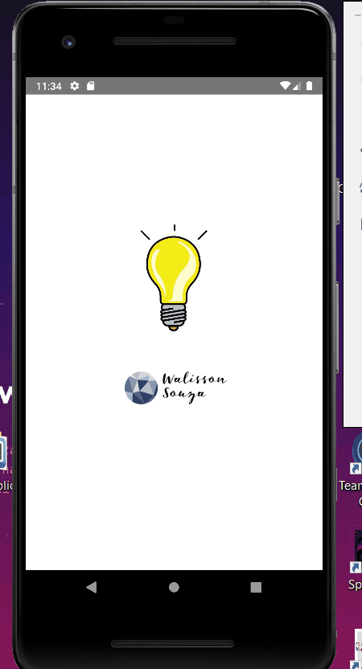

# LIGHT ON - LIGHT OFF

 Esse projeto com REACT NATIVE 👋 ⚛️ 

* [ 📌Sobre](#Sobre)
* [👨‍💻Tecnologias](#Tecnologias)
* [📋 Pré-requisitos](#Pré-requisitos)
* [🎁 Grato ](#Grato)

---
 

<h4 align="center"> 
 
💡  Projeto ligar e desligar lâmpada em REACT NATIVE ⚛️ 💡 
  </h4>

### Features
- [X] Criar Título
- [X] Criar Descrição
- [X] GIF's

# Sobre 📌
Projeto desenvolvido com o intuito de exercitar as habilidades aprendidas em react native. 🚧

# Tecnologias
React Native ⚛️

# Pré-requisitos 📋
Android Studio

# Grato 🎁
Obrigado por vir até aqui. Em breve terão mais projetos em react native.
<h1 align="center">
  
</h1>
